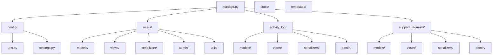

# 🧠 Portfólio Backend - Painel Administrativo com Django

Este projeto é um painel administrativo completo em Django, criado como portfólio profissional. Ele demonstra organização de código, uso de autenticação JWT, estrutura modular com múltiplos apps e pronta integração com frontend moderno via API REST documentada.

---

## 🚀 Tecnologias utilizadas

- **Django 4.x**
- **Django REST Framework**
- **JWT (SimpleJWT)**
- **Swagger com drf-spectacular**
- **Jazzmin (Admin personalizado)**
- **SQLite (limite controlado para ambiente gratuito)**
- **Docker**
- **Deploy via Render**

---

## 🧩 Funcionalidades

- Login via email e senha com JWT
- Criação e gerenciamento de usuários
- Endpoint `/me/` para dados do usuário autenticado
- Sistema de suporte com limite de 20 mensagens
- Registro de atividades com limite de 20 logs
- Painel Django Admin estilizado com dark theme
- Swagger com tags e autenticação

---

## 📁 Estrutura do Projeto



---

## 🔐 Autenticação

- Endpoint: `POST /auth/token/`
- Corpo da requisição:
```json
{
  "email": "seu@email.com",
  "password": "sua_senha"
}
```

- Use o token retornado no cabeçalho:
```
Authorization: Bearer <seu_token>
```

---

## 📄 Documentação da API (Swagger)

Acesse em:
```
/docs/
```

---

## 🧪 Testes locais

```bash
# Criar ambiente virtual
python -m venv venv
source venv/bin/activate

# Instalar dependências
pip install -r requirements.txt

# Rodar o servidor
python manage.py runserver
```

---

## 👤 Autor

Desenvolvido por **Eduardo Prestes** — engenheiro de computação apaixonado por automação, software de qualidade e plataformas inteligentes.

---

## 📎 Licença

Este projeto está sob a licença MIT.
